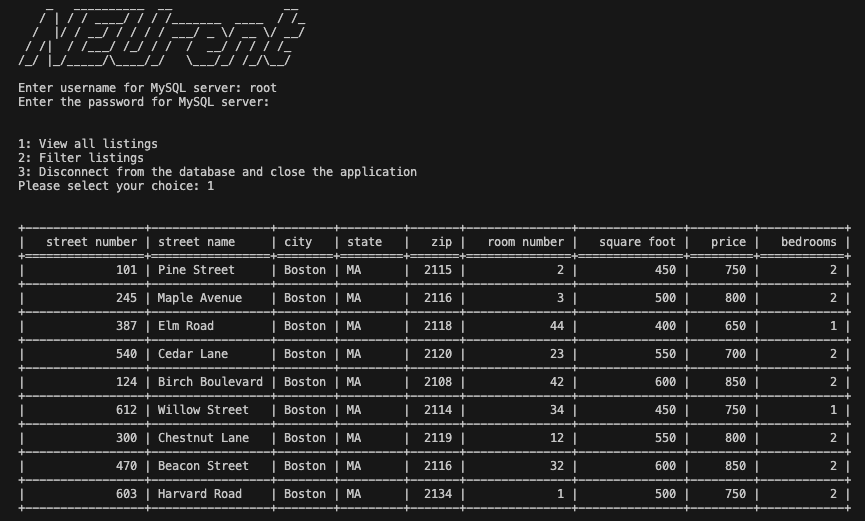

`Description`

NEUrent is a terminal-based Rental System Application that connects to a MySQL database and allows users to sign up, log in, and interact with property listings. All data is stored in a MySQL database, which must be created before running the application.

`Installation`

<ins>Database</ins>
Run the 'rental_system.sql' script in database folder to create the database. (Ensure the database is named 'rental_system'.)

<ins>Program</ins>
The main program is located in source. Navigate to source folder and run `python main.py`

`Demo`

